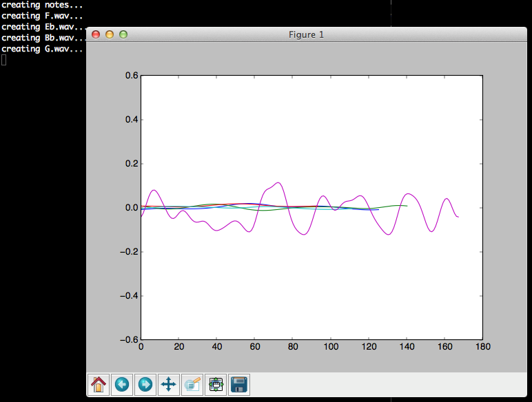

# Create Frequency Overtones with Python  

A small walkthrough on how to generate musical overtones with the Karplus-Strong algorithm.  

*Adapted from Python Playground, by Mahesh Venkitachalam.*  

Provides a step-by-step guide to turning quiet Python program output into an output you can hear!  

***  

## Introduction 

In this project, you'll first create a program to create a sound file to play a single note using the Karplus-Strong algorithm. Then, you'll generate five guitar-like notes of a musical scale (series of related notes) using the same algorithm. You'll visualize the algorithm used to generate these notes and save the sounds as WAV files. You'll also create a way to play them at random and learn how to do the following:  

* Implement a ring buffer using the Python `deque` class  
* Use `numpy` arrays and `ufuncs`  
* Play WAV files using `pygame`  
* Plot a graph using `matplotlib`  
* Play the pentatonic musical scale  

In addition to implementing the Karplus-Strong algorithm in Python, you'll also explore the WAV file format and see how to generate notes within a pentatonic musical scale.       
One of the characteristics of any musical sound is its pitch, or **frequency**. This is the number of vibrations per second in hertz (Hz). For example, the third string from the top of an acoustic guitar produces a D note, which has a frequency of 146.83 Hz. You can approximate this sound by creating a sine wave with the same vibrations per second on a computer.  

The dominant frequency you hear when you pluck the D string on a guitar, called the **fundamental frequency**, is the 146.83 Hz, but you also hear certain multiples of that frequency called **overtones**. This is true for any instrument, it is comprised of a fundamental frequency and overtones; it's the combination of these two that makes a flute sound like a flute, a guitar sound like a guitar, etc.  

So to simulate the sound of a plucked guitar string instrument on the computer, you need to be able to generate both the fundamental frequency and the overtones. To do this, we can use the **Karplus-Strong** algorithm.  

***  

## What is Happening   

The Karplus-Strong algorithm can simulate the sound of a plucked string by using a **ring buffer** of displacement values to simulate a string tied down at both ends, similar to a guitar string. Also known as a *circular buffer*, a ring buffer is a fixed-length (simply an array of values) that wraps around itself. In other words, when you reach the end of a buffer, the next element you access will be the first element in the buffer.  

The length (N) of the ring buffer is related to the fundamental frequency of vibration according to the equation N =S/*f*, where S is the sampling rate and *f* is the frequency.  

In the beginning of the simulation, the buffer is filled with random values in the range [-0.5, 0.5]. Think of this as the representation of the random displacement of a plucked string as it vibrates.

We'll use a **samples buffer** to store the intensity of the sound at any certain time. The length of this buffer and the sampling rate determine the length of the sound clip.  

### The Simulation  

The simulation proceeds until the sample buffer is loaded up in a feedback-style. Think of the samples buffer as a list: [t0, t1, t2, t3...]. To simulate a plucked string, fill a ring buffer with numbers that represent the energy of the wave. The sample buffer, which represents the final sound data, is created by iterating through the ring buffer values. We'll use an **averaging scheme** to update values in the ring buffer.

You would do the following for each step of the simulation:  

1. Store the value from the ring buffer in the samples buffer.  
2. Calculate the average of the first two elements in the ring buffer.  
3. Multiply this average value by an attenuation factor.  
4. Add (or append) this value to the end of the ring buffer.  
5. Remove the first element of the ring buffer.  

This feedback-style format is designed to simulate the traveling energy through a string that is vibrating.  

"The length of a vibrating string is inversely proportional to the fundamental frequency" -physics.  

Because we want to create sounds of a particular frequency, we'll choose a ring buffer length that is inversely proportional to that frequency.  

In step 1, above, the averaging that happens acts as the *low-pass filter* that cuts off higher frequencies and allows lower frequencies through, which eleminates higher *harmonics* (larger multiples of the fundamental frequency) because we only want the fundamental frequency. Finally, we'll use the attentuation factor to simulate the loss of energy as the wave moves back and forth along the string. This sample buffer we use in step 1 represents the amplitude of the created sound over time. To calculate the amplitude at any time, just update the ring buffer by calculating the average of its first two elements and multiply that result by an attenuation factor. The result is then added (or appended) to the end of the ring buffer, and the first element of the ring buffer is removed.  

***  

### Creating WAV Files  

The *Waveform Audio File Format (WAV)* is used to store audio data. This format is convenient for small audio projects, for it is simple and you do  not need to deal with complex compression techniques.  

WAV files consist of a series of bits representing the amplitude of the recorded sound at a given point in time, a.k.a **resolution**. A **sampling rate** is the number of times the audio is read, *or sampled*, every second. For our project, we will use a sampling rate of 44,100 Hz, the same rate used in audio compact discs (CDs).  

To generate a five-second audio clip of a 220 Hz in Python, you will use a formula to represent a sine wave:

<center>  

A = sin(2π*ft*)  

</center>  

Where A is the amplitude of the wave, *f* is the frequency, and *t* is the current time index. Let's rewrite the formula to fit our needs:  

<center>  

A = sin(2π*fi*/*R*)

</center>  

*i* is the index of the sample, *R* is the sampling rate.  

Using these two equations, we can create a WAV file for a 200 Hz sine wave.  

***  

### Create a 5-Sec WAV file for a 200 Hz Sine Wave Using Python  

Create a new Python file called, my_sine_wave.py  

```python  
import numpy as np
import wave, math

sRate = 44100
nSamples = sRate * 5

# Create a numpy array of amplitude values via the second sine wave equation:
x = np.arange(nSamples)/float(sRate)
vals = np.sin(2.0*math.pi*220.0*x)

# So we can write to a file, the computed sine wave values in the range [-1, 1] are
# scaled to 16-bit values and converted to a string:
data = np.array(vals*32767, 'int16').tostring()
file = wave.open('sine220.wav', 'wb')

# Set the parameters of the WAAV file:
file.setparams((1, 2, sRate, nSamples, 'NONE', 'uncompressed'))

# Write to the file using the parameters above:
file.writeframes(data)

# Close the file
file.close()
```  

After executing the program, a WAV file is created. Play the file to hear the sound! You will hear a 220 Hz tone for five seconds. 

#### To Play this WAV file on UBUNTU (trusty):  

`sudo apt-get install audacity`  

<center>  

  

</center>  

Above shows the WAV file we generated in a free audio editor, Audacity. As we expect, we can see a sine wave frequency of 220 Hz. 

***  

### The Minor Pentatonic Scale  

The **musical scale** is a series of notes in increasing or decreasing pitch or frequency. A **musical interval** is the difference between two pitches. Usually, all notes in a piece of music are chosen from a particular scale. A **semitone** is a basic building block of a scale and is the smallest musical interval in *western* music. A **tone** is twice the length of a semitone. The **major scale**, one of the most common musical scales, is defined by the interval pattern *tone-tone-semitone-tone-tone-tone-semitone*.  

***  

# Create the Project: slice-by-slice 

In this project, we'll use our friend, Python and its `wave` module to create audio files in the WAV format. We'll also use `numpy` arrays for the Karplus-Strong algorithm and the `deque` class from Python collections to implement the famous ring buffer. Finally, we will play back the WAV files using `pygame`.  

We'll go over each part (or slice), then put it all together into a finished product.  

## Implementing the Ring Buffer with deque  

Remember, the Karplus-Strong algorithm uses a ring-buffer to create a musical note. You'll implement the ring buffer using Python's `deque` container ("deck"), which provides specialized container data types in an array. You can add or remove elements from the *head* (beginning) or *tail* (end) of a `deque`. This insertion-removal process is a O(1), or a "constant time" operation. This simply means it will take the same amount of time despite how big the `deque` container might get.  

Open up a terminal, then open Python by typing: `python`  

```python  
>>> from collections import deque  
>>> d = deque(range(10))
>>> print(d)
>>> d.append(-1)
>>> print(d)
>>> d.popleft()
>>> print(d)
```  

First, we created the `deque` container by passing in a list with the range() method.   
Second, we added an element to the end of the `deque` container, signified with (-1).  
Lastly, we removed the first element from the head of the `deque` using the pop() method.  

***  

Now, we will begin piecing together our main project. Here are the four pieces we'll first work on separately:  

1. Implement the Karplus-Strong Algorithm  
2. Write the WAV Files  
3. Play the WAV Files with Pygame  
4. Create the main() Method  

## Slice 1 - Karplus-Strong Algorithm  

Let's use the `deque` container to implement the Karplus-String algorithm for the ring buffer:  

```python  
# generate note of given frequency
def generateNote(freq):
    nSamples = 44100
    sampleRate = 44100
    N = int(sampleRate/freq)
    # initialize ring buffer
    buf = deque([random.random() - 0.5 for i in range(N)])
    # init sample buffer
    samples = np.array([0]*nSamples, 'float32')
    for i in range(nSamples):
        samples[i] = buf[0]
        avg = 0.995*0.5*(buf[0] + buf[1])
        buf.append(avg)
        buf.popleft()  
        # plot of flag set 
        if gShowPlot:
            if i % 1000 == 0:
                axline.set_ydata(buf)
                plt.draw()
      
    # samples to 16-bit to string
    # max value is 32767 for 16-bit
    samples = np.array(samples * 32767, 'int16')
    return samples.tostring()
```  

* `buf = deque([random.random() - 0.5 for i in range(N)])` -- initializes the deque with random numbers in the range [-0.5, 0.5].  

* `samples = np.array([0]*nSamples, 'float32')` -- sets up a float array to store the sound samples. The length of this array matches the sampling rate, which means the sound clip will be created for one second.  

* In the `for loop` -- the first element in deque is copied to the samples buffer. 
    - `buf.append(avg)` and `buf.popleft()` is the low-pass filter attenuation at work!  

*  `samples = np.array(samples * 32767, 'int16')` -- by multiplying each value by 32,767, the samples array is converted into a 16-bit scheme.  

* `return samples.tostring()` converts samples to a string for the wave module, which will be used to save this data to a file.  

## Slice 2 - Write the WAV Files  

Now that we have the audio data, we can write it to a WAV file using the Python `wave` module.  

```python  
# write out WAVE file
def writeWAVE(fname, data):
    # open file
    file = wave.open(fname, 'wb')
    # WAV file parameters 
    nChannels = 1
    sampleWidth = 2
    frameRate = 44100
    nFrames = 44100
    # set parameters
    file.setparams((nChannels, sampleWidth, frameRate, nFrames,
                    'NONE', 'noncompressed'))
    file.writeframes(data)
    file.close()
```  

## Slice 3 - Play the WAV Files with Pygame  

Using Python `pygame` module, we can play the WAV files that will be created by the algorithm. We will **encapsulate** the code in a `NotePlayer` class.   

```python  
# play a wav file
class NotePlayer:
    # constructor
    def __init__(self):
        pygame.mixer.pre_init(44100, -16, 1, 2048)
        pygame.init()
        # dictionary of notes
        self.notes = {}
    # add a note
    def add(self, fileName):
        self.notes[fileName] = pygame.mixer.Sound(fileName)
    # play a note
    def play(self, fileName):
        try:
            self.notes[fileName].play()
        except:
            print(fileName + ' not found!')
    def playRandom(self):
        """play a random note"""
        index = random.randint(0, len(self.notes)-1)
        note = list(self.notes.values())[index]
        note.play()
```  

## Slice 4 - The main() Method    

Creates the notes and handles different command line options to play the notes.  

```python  
def main():
    # declare global var
    global gShowPlot

    parser = argparse.ArgumentParser(description="Generating sounds with Karplus String Algorithm.")
    # add arguments
    parser.add_argument('--display', action='store_true', required=False)
    parser.add_argument('--play', action='store_true', required=False)
    parser.add_argument('--piano', action='store_true', required=False)
    args = parser.parse_args()

    # show plot if flag set
    if args.display:
        gShowPlot = True
        plt.ion()

    # create note player
    nplayer = NotePlayer()

    print('creating notes...')
    for name, freq in list(pmNotes.items()):
        fileName = name + '.wav' 
        if not os.path.exists(fileName) or args.display:
            data = generateNote(freq) 
            print('creating ' + fileName + '...')
            writeWAVE(fileName, data) 
        else:
            print('fileName already created. skipping...')
        
        # add note to player
        nplayer.add(name + '.wav')
        
        # play note if display flag set
        if args.display:
            nplayer.play(name + '.wav')
            time.sleep(0.5)
    
    # play a random tune
    if args.play:
        while True:
            try: 
                nplayer.playRandom()
                # rest - 1 to 8 beats
                rest = np.random.choice([1, 2, 4, 8], 1, 
                                        p=[0.15, 0.7, 0.1, 0.05])
                time.sleep(0.25*rest[0])
            except KeyboardInterrupt:
                exit()
```  


<center>  


</center>  


